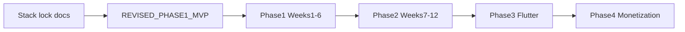

# Impact Map — Decisions → LLD & repo

**Status:** `DRAFT` — update after rows in [DECISIONS.md](./DECISIONS.md) are `LOCKED`.

Maps locked decisions to LLD sections, repository paths, and roadmap phases.

---

## LLD sections to treat as authoritative vs updated

| LLD section | Topic | Action |
|-------------|-------|--------|
| §1 System Overview | Architecture, Railway/AWS | **Keep** — no stack change |
| §2 Database Design | Schema, indexes | **Keep** — implement via Alembic `001_initial` |
| §3 Backend API | FastAPI, endpoints | **Keep** — wire rate limits pre-launch |
| §4 Data Pipeline | Celery, scrapers | **Update** — D1 locked: SEC 13F bulk + `edgartools`; refactor `pipeline/app/scrapers/us/edgar_13f.py`, add bulk loader, adjust beat schedule |
| §5 Next.js Website | Pages, packages | **Update §5.2** — versions aligned to Next 16 / React 19 / Tailwind 4 |
| §6 Flutter Mobile | Phase 3 | **Keep** — unchanged timing |
| §7 Notifications | FCM | **Keep** — Phase 2 |
| §8 Infrastructure | Docker, Railway | **Keep** — fix Makefile `migrate` target |
| §11 Testing | pytest, Playwright | **Defer tools** — add in Phase 1 week 5–6 per revised MVP |
| §12 Monorepo layout | Directory tree | **Update** — `docs/` pre-build artifacts; README = quickstart |
| §13 Phases | 24-week plan | **Superseded for Phase 1 ordering** by [REVISED_PHASE1_MVP.md](./REVISED_PHASE1_MVP.md) |

---

## Repository files by change type

### Documentation (this pre-build pass)

| File | Change |
|------|--------|
| [docs/PRE_BUILD_STACK_DECISIONS.md](./PRE_BUILD_STACK_DECISIONS.md) | Created — stack lock |
| [docs/IMPACT_MAP.md](./IMPACT_MAP.md) | Created — this file |
| [docs/REVISED_PHASE1_MVP.md](./REVISED_PHASE1_MVP.md) | Created — Phase 1 execution order |
| [docs/README.md](./README.md) | Created — docs index |
| [docs/LOW_LEVEL_DESIGN.md](./LOW_LEVEL_DESIGN.md) | Pointer to root LLD |
| [README.md](../README.md) | Replaced — developer quickstart (no longer full LLD duplicate) |
| [LOW_LEVEL_DESIGN.md](../LOW_LEVEL_DESIGN.md) | Header + §5.2 + §12 + pre-build pointer |

### Tooling & data foundation

| File | Change |
|------|--------|
| [Makefile](../Makefile) | `migrate` runs from `migrations/` |
| [migrations/versions/001_initial_schema.py](../migrations/versions/001_initial_schema.py) | Initial schema from ORM |
| [migrations/env.py](../migrations/env.py) | `DATABASE_URL` from environment |
| [backend/app/scripts/seed_investors.py](../backend/app/scripts/seed_investors.py) | Seed top US investors + CIKs |
| [backend/app/scripts/__init__.py](../backend/app/scripts/__init__.py) | Package init |

### Pipeline (minimal dev-safe wiring)

| File | Change |
|------|--------|
| [pipeline/app/db.py](../pipeline/app/db.py) | Backend model import path + session helper |
| [pipeline/app/scrapers/base.py](../pipeline/app/scrapers/base.py) | `_save_filing` / `_store_raw` dev-safe behavior |
| [pipeline/app/tasks/scraping_tasks.py](../pipeline/app/tasks/scraping_tasks.py) | Inject DB session + optional S3 |

---

## Phase timeline impact

| Phase | Impact of pre-build decisions |
|-------|------------------------------|
| **Phase 1** | Web stack pins (Next 16); migrations + seed unblock pipeline CIKs; README quickstart for onboarding |
| **Phase 2** | Firebase/FCM unchanged; Zustand + TanStack Query used for dashboard |
| **Phase 3** | Flutter still consumes same `/api/v1` |
| **Phase 4** | Stripe/RevenueCat unchanged |

---

## Gaps closed vs deferred

| Gap (from plan) | Status after pre-build pass |
|-----------------|----------------------------|
| README = full LLD duplicate | **Closed** — README is quickstart |
| `docs/LOW_LEVEL_DESIGN.md` path | **Closed** — pointer in `docs/` |
| Empty Alembic versions | **Closed** — `001_initial_schema` |
| Makefile migrate path | **Closed** |
| Missing seed script | **Closed** |
| `_save_filing` stub | **Partial** — persists when DB session provided; full holdings pipeline still Phase 1 week 3–4 |
| Celery `db_session=None` | **Closed** — tasks open session via `pipeline/app/db.py` |
| Tests / deploy.yml | **Deferred** — Phase 1 MVP weeks 5–6 |
