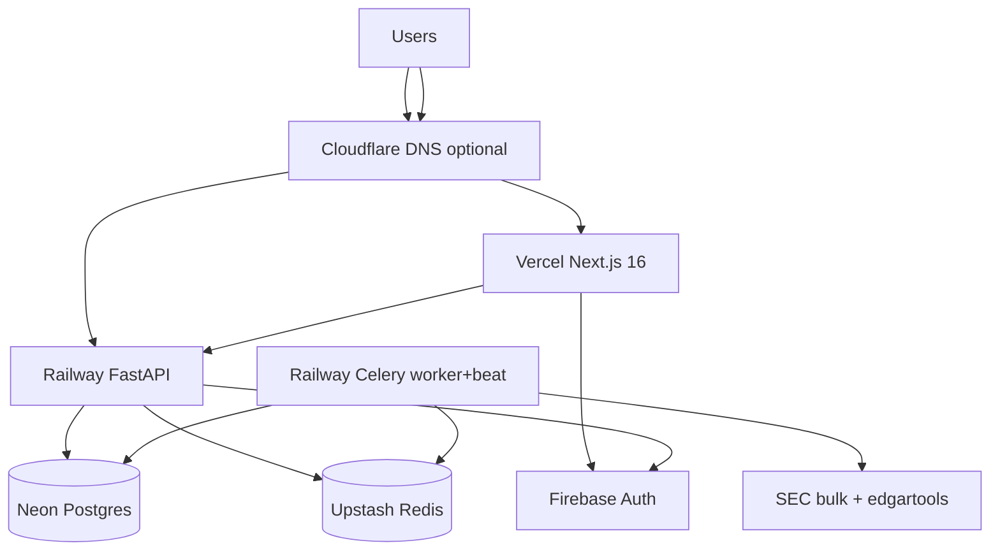

# Phase 1 infrastructure (locked)

From [DECISIONS.md](./DECISIONS.md) **S1–S8**, **D2**, **A1**.

## Architecture

## Services

| Component | Provider | Notes |
|-----------|----------|--------|
| Web | **Vercel** | `web/`; `NEXT_PUBLIC_API_URL` → Railway API |
| API | **Railway** service `api` | `backend/`; health `/health` |
| Pipeline | **Railway** service `pipeline` | `pipeline/`; worker + beat in one deploy |
| Database | **Neon** | Postgres 16; `DATABASE_URL` on API + pipeline |
| Redis | **Upstash** | `REDIS_URL`, `CELERY_BROKER_URL` |
| Auth | **Firebase Auth** | Google + email; API verifies JWT |
| Object storage | **None** | Parsed data in `filings.raw_data` (D2) |
| Errors | **Sentry** | Optional until production |

## Env vars (sketch)

**API (Railway):** `DATABASE_URL`, `REDIS_URL`, `CORS_ORIGINS`, `FIREBASE_*`, `SENTRY_DSN` (optional)

**Pipeline (Railway):** `DATABASE_URL`, `CELERY_BROKER_URL`, `REDIS_URL`, `CONTACT_EMAIL` (SEC User-Agent)

**Web (Vercel):** `NEXT_PUBLIC_API_URL`, Firebase client config

## Cost estimate (early)

| Service | Typical |
|---------|---------|
| Vercel hobby | $0 |
| Neon free | $0 |
| Upstash free | $0 |
| Firebase Auth | $0 |
| Railway 2 services | ~$10–20/mo |
| **Total** | **~$10–20/mo** |

## Not on Railway

Do **not** provision Railway Postgres/Redis plugins — use Neon + Upstash URLs to avoid duplicate billing.
