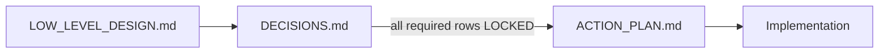

# Portfolio Tracker — Planning docs

**Build order:** finalize design and decisions **before** writing product code.

## Workflow

| Step | Document | Your job |
|------|----------|----------|
| 1 | **[PHASE1.md](./PHASE1.md)** | **Start here** — Phase 1 build playbook |
| 2 | [DECISIONS.md](./DECISIONS.md) | Locked scope (reference) |
| 3 | [ACTION_PLAN.md](./ACTION_PLAN.md) | Task checkboxes |
| 4 | [INFRA_PHASE1.md](./INFRA_PHASE1.md) | Deploy + env |
| 5 | [../LOW_LEVEL_DESIGN.md](../LOW_LEVEL_DESIGN.md) | Deep schema/API/UI detail when needed |

## Supporting files

| File | Purpose |
|------|---------|
| [LLD_INDEX.md](./LLD_INDEX.md) | Table of contents for the main LLD |
| [IMPACT_MAP.md](./IMPACT_MAP.md) | Which LLD sections change when you update DECISIONS |
| [INFRA_PHASE1.md](./INFRA_PHASE1.md) | Locked hosting: Vercel + Neon + Upstash + Railway + Firebase |
| [PHASE1.md](./PHASE1.md) | **Phase 1 build playbook** (API routes, web routes, pipeline, gaps) |

## Draft / deprecated

These were created during an early pass and are **not** locked until you complete DECISIONS.md:

- [PRE_BUILD_STACK_DECISIONS.md](./PRE_BUILD_STACK_DECISIONS.md) — superseded by DECISIONS.md
- [REVISED_PHASE1_MVP.md](./REVISED_PHASE1_MVP.md) — merged into ACTION_PLAN.md (draft)
